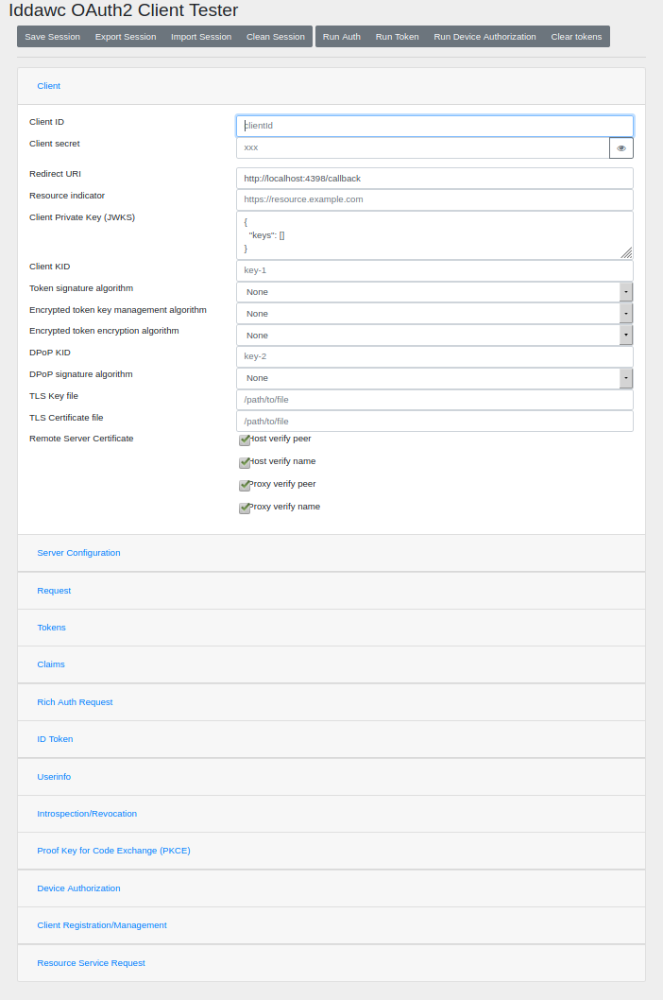

# Iddawc - OAuth2/OIDC Client and Relying Party library


Handles the OAuth2 and OpenID Connect authentication process flow from the client side.
- Generates requests based on input parameters
- Parses response
- Validates response values

Supported response_types: `code`, `token`, `id_token`, `password`, `client_credentials`, `refresh_token`, `device_code`
Supported client authentication methods: `client_secret_basic`, `client_secret_post`, `client_secret_jwt`, `private_key_jwt`

Supported features:
- [Proof Key for Code Exchange by OAuth Public Clients](https://tools.ietf.org/html/rfc7636)
- [Token introspection (RFC 7662)](https://tools.ietf.org/html/rfc7662)
- [Token revocation (RFC 7009)](https://tools.ietf.org/html/rfc7009)
- [OpenID Connect Dynamic Registration](http://openid.net/specs/openid-connect-registration-1_0.html)
- [OAuth 2.0 Dynamic Client Registration Protocol](https://tools.ietf.org/html/rfc7591)
- [OAuth 2.0 Dynamic Client Registration Management Protocol](https://tools.ietf.org/html/rfc7592)
- [OAuth 2.0 Demonstration of Proof-of-Possession at the Application Layer (DPoP) Draft 07](https://datatracker.ietf.org/doc/html/draft-ietf-oauth-dpop-07)
- [OAuth 2.0 Rich Authorization Requests Draft 11](https://www.ietf.org/archive/id/draft-ietf-oauth-rar-11.html)
- [OAuth 2.0 Pushed Authorization Requests](https://datatracker.ietf.org/doc/html/rfc9126)
- [JSON Web Token (JWT) Profile for OAuth 2.0 Access Tokens](https://datatracker.ietf.org/doc/html/rfc9068)
- [Messages encryption](https://openid.net/specs/openid-connect-core-1_0.html#Encryption)

Example for `code` and `id_token` response types on an OpenID Connect server.

```C
/**
 * Compile with
 * gcc -o test_iddawc test_iddawc.c -liddawc
 */
#include <stdio.h>
#include <iddawc.h>

int main() {
  struct _i_session i_session;

  i_init_session(&i_session);
  i_set_parameter_list(&i_session, I_OPT_RESPONSE_TYPE, I_RESPONSE_TYPE_ID_TOKEN|I_RESPONSE_TYPE_CODE,
                                   I_OPT_OPENID_CONFIG_ENDPOINT, "https://oidc.tld/.well-known/openid-configuration",
                                   I_OPT_CLIENT_ID, "client1",
                                   I_OPT_CIENT_SECRET, "mySecret",
                                   I_OPT_REDIRECT_URI, "https://my-client.tld",
                                   I_OPT_SCOPE, "openid",
                                   I_OPT_STATE_GENERATE, 16,
                                   I_OPT_NONCE_GENERATE, 32,
                                   I_OPT_NONE);
  if (i_get_openid_config(&i_session)) {
    fprintf(stderr, "Error loading openid-configuration\n");
    i_clean_session(&i_session);
    return 1;
  }

  // First step: get redirection to login page
  if (i_build_auth_url_get(&i_session)) {
    fprintf(stderr, "Error building auth request\n");
    i_clean_session(&i_session);
    return 1;
  }
  printf("Redirect to: %s\n", i_get_str_parameter(&i_session, I_OPT_REDIRECT_TO));

  // When the user has logged in the external application, gets redirected with a result, we parse the result
  fprintf(stdout, "Enter redirect URL\n");
  fgets(redirect_to, 4096, stdin);
  redirect_to[strlen(redirect_to)-1] = '\0';
  i_set_str_parameter(&i_session, I_OPT_REDIRECT_TO, redirect_to);
  if (i_parse_redirect_to(&i_session) != I_OK) {
    fprintf(stderr, "Error parsing redirect_to url\n");
    i_clean_session(&i_session);
    return 1;
  }

  // Run the token request, get the refresh and access tokens
  if (i_run_token_request(&i_session) != I_OK) {
    fprintf(stderr, "Error running token request\n");
    i_clean_session(&i_session);
    return 1;
  }
  
  // And finally we load user info using the access token
  if (i_get_userinfo(&i_session, 0) != I_OK) {
    fprintf(stderr, "Error loading userinfo\n");
    i_clean_session(&i_session);
    return 1;
  }

  fprintf(stdout, "userinfo:\n%s\n", i_get_str_parameter(&i_session, I_OPT_USERINFO));
  
  // Cleanup session
  i_clean_session(&i_session);

  return 0;
}
```

# Idwcc - Universal OAuth2/OIDC client

Client program to test or validate an OAuth2/OIDC authorization server configuration.

idwcc is installed by default if you use the precompiled packages or if you build with CMake.

## Run Idwcc

To run idwcc, use the `idwcc` command or the docker image if you don't want to install iddawc and its dependencies:

```shell
$ # run locally
$ idwcc
$ # run docker instance
$ docker run -it --rm -p 4398:4398 babelouest/idwcc:latest
```

More information in the [idwcc README](tools/idwcc/README.md).



# Install

Iddawc is available in the following distributions.

[](https://repology.org/project/iddawc/versions)

## Dependencies

Iddawc is based on [GnuTLS](https://www.gnutls.org/), [Jansson](http://www.digip.org/jansson/), [zlib](https://www.zlib.net/), [libmicrohttpd](https://www.gnu.org/software/libmicrohttpd/), [libcurl](https://curl.haxx.se/libcurl/) and libsystemd (if possible), you must install those libraries first before building Iddawc.

GnuTLS 3.6 minimum is required for JWT signed with `ECDSA`, `Ed25519 (EDDSA)` and `RSA-PSS` signatures.

## Prerequisites

You need [Orcania](https://github.com/babelouest/orcania), [Yder](https://github.com/babelouest/yder), [Ulfius](https://github.com/babelouest/ulfius) and [Rhonabwy](https://github.com/babelouest/rhonabwy).

Those libraries are included in the package `iddawc-dev-full_{x.x.x}_{OS}_{ARCH}.tar.gz` in the [Latest release](https://github.com/babelouest/iddawc/releases/latest) page. If you're building with CMake, they will be automatically downloaded and installed if missing.

## Pre-compiled packages

You can install Iddawc with a pre-compiled package available in the [release pages](https://github.com/babelouest/iddawc/releases/latest/).

## Manual install

### CMake - Multi architecture

[CMake](https://cmake.org/download/) minimum 3.5 is required.

Run the CMake script in a sub-directory, example:

```shell
$ git clone https://github.com/babelouest/iddawc.git
$ cd iddawc/
$ mkdir build
$ cd build
$ cmake ..
$ make && sudo make install
```

The available options for CMake are:
- `-DWITH_JOURNALD=[on|off]` (default `on`): Build with journald (SystemD) support
- `-DBUILD_IDWCC=[on|off]` (default `on`): Build idwcc
- `-BUILD_IDDAWC_TESTING=[on|off]` (default `off`): Build unit tests
- `-DINSTALL_HEADER=[on|off]` (default `on`): Install header file `iddawc.h`
- `-DBUILD_RPM=[on|off]` (default `off`): Build RPM package when running `make package`
- `-DCMAKE_BUILD_TYPE=[Debug|Release]` (default `Release`): Compile with debugging symbols or not

### Good ol' Makefile

Download Iddawc from GitHub repository, compile and install.

```shell
$ git clone https://github.com/babelouest/iddawc.git
$ cd iddawc/src
$ make
$ sudo make install
```

By default, the shared library and the header file will be installed in the `/usr/local` location. To change this setting, you can modify the `DESTDIR` value in the `src/Makefile`.

Example: install Iddawc in /tmp/lib directory

```shell
$ cd src
$ make && make DESTDIR=/tmp install
```

You can install Iddawc without root permission if your user has write access to `$(DESTDIR)`.
A `ldconfig` command is executed at the end of the install, it will probably fail if you don't have root permission, but this is harmless.
If you choose to install Iddawc in another directory, you must set your environment variable `LD_LIBRARY_PATH` properly.

# API Documentation

Documentation is available in the documentation page: [https://babelouest.github.io/iddawc/](https://babelouest.github.io/iddawc/)
